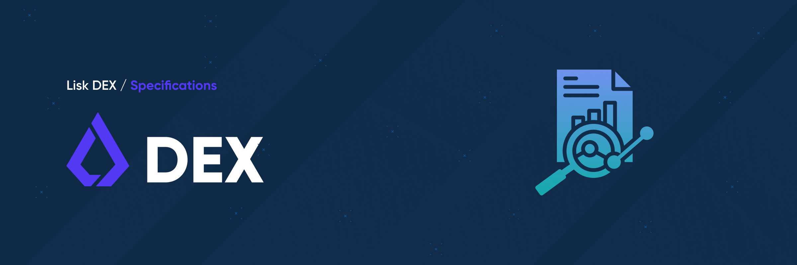

# Lisk DEX: Specs

This repository contains the completed research specifications of the [Lisk DEX: Core](https://github.com/LiskHQ/lisk-dex-core) blockchain application, a [UniSwap v3](https://blog.uniswap.org/uniswap-v3) inspired decentralized exchange application developed using the [Lisk SDK](https://github.com/LiskHQ/lisk-sdk).

The specifications within this repository are provided on an "AS IS" BASIS, WITHOUT WARRANTIES OR CONDITIONS OF ANY KIND, either express or implied.

## Project Index

Below is an index of the repositories which relate to this repository for easy navigation:

|     | Repository                                                                               | Description                                             |
| --- | ---------------------------------------------------------------------------------------- | ------------------------------------------------------- |
| X   | [Lisk DEX: Specs](https://github.com/LiskHQ/lisk-dex-specs?tab=readme-ov-file#index)     | The Lisk DEX blockchain specifications.                 |
|     | [Lisk DEX: Core](https://github.com/LiskHQ/lisk-dex-core?tab=readme-ov-file#index)       | The Lisk DEX blockchain application.                    |
|     | [Lisk DEX: Service](https://github.com/LiskHQ/lisk-dex-service?tab=readme-ov-file#index) | The Lisk DEX blockchain middleware between Core and UI. |
|     | [Lisk DEX: UI](https://github.com/LiskHQ/lisk-dex-ui?tab=readme-ov-file#index)           | The Lisk DEX blockchain user-interface.                 |

## Specifications

Below are the completed research specifications of the Lisk DEX project:

| ID                             | Specifications                                        | Author                                        |
| ------------------------------ | ----------------------------------------------------- | --------------------------------------------- |
| [0001](specifications/0001.md) | Introduce DEX module                                  | Iker Alustiza, Jan Hackfeld, Sergey Shemyakov |
| [0002](specifications/0002.md) | Define liquidity provider interactions for DEX module | Jan Hackfeld                                  |
| [0003](specifications/0003.md) | Define swap interaction for DEX module                | Iker Alustiza, Sergey Shemyakov               |
| [0004](specifications/0004.md) | Introduce DEX incentives module                       | Sergey Shemyakov                              |
| [0005](specifications/0005.md) | Introduce DEX Governance module                       | Sergey Shemyakov                              |
| [0006](specifications/0006.md) | Define DEX sidechain configuration                    | Jan Hackfeld                                  |
| [0007](specifications/0007.md) | Define cross-chain swaps                              | Vikas Jaiman                                  |
