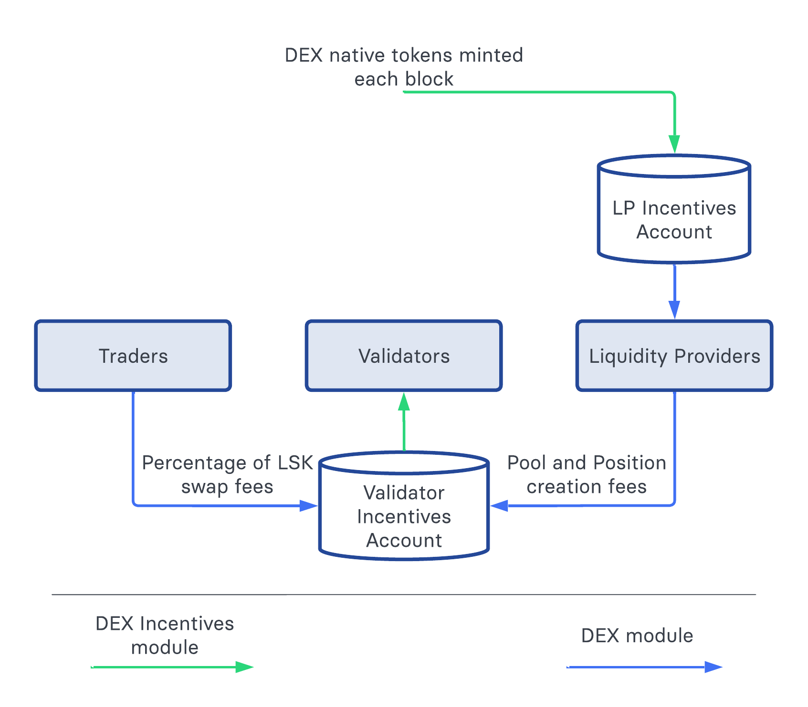

```
ID:     0004
Title:  Introduce DEX Incentives module
Author: Sergey Shemyakov <sergey.shemyakov@lightcurve.io>
Created: 2023-06-09
Updated: 2023-06-09
```

## Abstract

These specifications introduces the DEX Incentives module that is responsible for the minting and distributing incentives in native tokens on the DEX sidechain. Specifically, it is fundamental to the token economics of the DEX native token. In these specifications we define the constants, state transitions and events of the DEX Incentives module.

## Copyright

These specifications are licensed under the [Creative Commons Zero 1.0 Universal](https://creativecommons.org/publicdomain/zero/1.0/).

## Motivation

The decentralized exchange sidechain in the Lisk ecosystem has three different types of actors: validators, traders and liquidity providers. The goal of the DEX Incentives module is to incentivize the participation of validators and liquidity providers and to guide the DEX sidechain native token economics together with the [Dynamic Reward module][dynamicRewardsLip].

Liquidity providers are the main actors in a decentralized exchange: their liquidity makes swaps possible. DEX Incentives module aims to attract token holders by giving out native tokens of the DEX sidechain. In additional to financial gain, liquidity providers obtain a stake in the whole sidechain and are motivated to further contribute to the success of the exchange.

In addition to providing liquidity, the job of securing the chain is essential since the DEX sidechain will keep big volumes of different tokens. Validator incentivization aims to motivate users to invest their DEX tokens into supporting the chain. Validators receive a percentage of LSK token swap fees as well as the LSK fees paid by liquidity providers for creating pools and positions.

Note that the DEX Incentives module does not mint reward tokens to validators but only distributes collected tokens. The block rewarding logic should be handled by a different module (for example, [Dynamic Reward module][dynamicRewardsLip]), which allows to keep this logic separate from the incentivization logic.

## Rationale

Incentivization is accomplished together with the [DEX module][dexModule]: the DEX Incentives module mints DEX sidechain native tokens to the Liquidity Provider Incentives account. The DEX module distributes tokens from this account among liquidity providers. Additionally, the DEX module collects LSK incentives for DEX sidechain validators and the DEX Incentives module distributes the collected tokens between validators once every round.




_Figure 1: the diagram of DEX incentives payout. The green arrows indicate the logic specified in the DEX Incentives module, the blue arrows indicate the DEX module logic._

The incentives in LSK for validators provide additional motivation to be a DEX sidechain validator and thus boosts the value of the DEX sidechain token.

### Liquidity Provider Incentive Payout

Liquidity provider incentives are paid out in the DEX module, however we explain the payout logic here.

Liquidity providers are incentivized to provide liquidity in particular pools, as indicated by the incentivized pool list in the DEX module. The incentives are paid out together with the collected fees. The amount is proportional to the liquidity provided and to the number of blocks when the price was in the range of the position at the end of the block. Additionally, the incentives depend on the incentivized pool multiplier: the higher is the multiplier of a pool, the bigger amount of tokens is distributed among the liqudity providers of the pool.

These payout algorithms aim to incentivize the actors proportionally to their contribution and to the time duration when their liquidity was active. The minting of a fixed amount of incentives per block bounds the DEX native token inflation.

### Validator Incentives

Once every round DEX incentives module distributes the LSK tokens from the validator incentives account among the current validators. Note that the payout is not tied to the beginning or end of the round, it just happens every `ROUND_LENGTH` blocks. Standby validators receive an average share (computed as total amount of incentives divided by the number of validators), other validators share the rest of incentives proportionally to their BFT weight. In this way the incentives correspond to the validator contribution to the sidechain.

Validator incentives are collected as a percentage of all LSK swap fees. Also minimal transaction fees and command specific fees on the DEX sidechain could be awarded to the validators, this logic could be specified in the Fee module on the DEX sidechain.

## Specification

The DEX Incentives module has module name `MODULE_NAME_DEX_INCENTIVES`.

### Types

The functions defined in these specifications use the following type.

|Name            | Type              | Validation                           | Description                           |
|----------------|-------------------|--------------------------------------|---------------------------------------|
| Validator     | object           | must correspond to `validatorSchema` from [LIP 0044][validatorsModuleLip]                 | Object representing a validator |


### Notation and Constants

We define the following constants:

| **Name**                  |   **Type**        |       **Value**       |       **Description**                                 |
|---------------------------|-------------------|-----------------------|-------------------------------------------------------|
|`MODULE_NAME_DEX_INCENTIVES`  |     `string`        |     "dexIncentives"      |Name of the DEX Incentives module.                   |
|`MODULE_NAME_DEX`          |     `string`        |           "dex"       |Name of the DEX module, as  defined in the [DEX module][dexModule].|
|`EVENT_NAME_VALIDATOR_INCENTIVES_PAYOUT`|`string`|   "validatorIncentivesPayout"  |Name of the validator trade incentives payout event.|
|`NUM_BYTES_ADDRESS`        |   `uint32`        |           20          |The number of bytes of an address.|
|`TOKEN_ID_DEX_NATIVE`      |   `bytes`           |           TBA         |Token ID of the native token of DEX sidechain.         |
|   `TOKEN_ID_LSK`          |   `bytes`           |`0x00 00 00 00 00 00 00 00`|       Token ID of the LSK token.                  |
|**Configurable constants**   |                   |   **DEX Sidechain value** |                                                   |
|`ADDRESS_LIQUIDITY_PROVIDER_INCENTIVES` |`bytes`|`SHA256(b"liquidityProviderIncentivesAccount")[:NUM_BYTES_ADDRESS]`|  The address of the liquidity provider incentives account, as  defined in the [DEX module][dexModule].|
|`ADDRESS_VALIDATOR_INCENTIVES`|`bytes`|`SHA256(b"validatorIncentivesAccount")[:NUM_BYTES_ADDRESS]`|The address of the validator incentives account, as  defined in the [DEX module][dexModule].|
|   `LENGTH_EPOCH_REWARDS_INCENTIVES`          |   `uint32`           | 3153600 |           The duration of the epoch after which liquidity incentives decrease. The value is equal to `6 * 60 * 24 * 365`, i.e., the number of block slots in 365 days given 10 second block slots.   |
|   `BOOTSTRAP_PERIOD_OFFSET`   | `uint32`  | 259975 | The height of the first block after the bootstrap period. It is equal to `2574 * 101 + 1`, where 2574 is the number of rounds in the bootstrap period and 101 is the number of bootstrap validators. |

### State Store

This module does not use the state store.

### Commands

This module does not define any commands.

### Event

#### validatorIncentivesPayout

This event is emitted when the validator LSK incentives are transferred to a validator. It has the name `EVENT_NAME_VALIDATOR_INCENTIVES_PAYOUT`.

##### Topics

- `validatorAddress`: the address of the validator that obtains the fee.

##### Data

```java
validatorIncentivesPayoutSchema = {
    type: "object",
    properties: {
        "amount": {
            "dataType": "uint64",
            "fieldNumber": 1
        }
    }
    required = ["amount"]
}
```

- `amount`: the amount of incentives in LSK paid to the validator.

### Internal Functions

The DEX Incentives module defines the following internal functions.

#### getLiquidityIncentivesAtHeight

The function returns the amount of liquidity incentives to be minted for a block at the given height.

##### Execution

```python
def getLiquidityIncentivesAtHeight(height: uint32) -> uint64:
    if height < BOOTSTRAP_PERIOD_OFFSET:
        # no incentives during the bootstrap period
        return 0
    if height < BOOTSTRAP_PERIOD_OFFSET + LENGTH_EPOCH_REWARDS_INCENTIVES:
        return 400000000
    if height < BOOTSTRAP_PERIOD_OFFSET + 2*LENGTH_EPOCH_REWARDS_INCENTIVES:
        return 350000000
    if height < BOOTSTRAP_PERIOD_OFFSET + 3*LENGTH_EPOCH_REWARDS_INCENTIVES:
        return 300000000
    if height < BOOTSTRAP_PERIOD_OFFSET + 4*LENGTH_EPOCH_REWARDS_INCENTIVES:
        return 250000000
    return 200000000
```

#### transferAllValidatorLSKIncentives

This function transfers the validator LSK incentives from the validator incentives account, sharing it among the current validators proportionally to their BFT weight.

##### Execution

```python
def transferAllValidatorLSKIncentives(validators: list[Validator]) -> None:
    availableIncentives = Token.getLockedAmount(ADDRESS_VALIDATOR_INCENTIVES, MODULE_NAME_DEX, TOKEN_ID_LSK)
    if availableIncentives != 0:
        Token.unlock(ADDRESS_VALIDATOR_INCENTIVES, MODULE_NAME_DEX, TOKEN_ID_LSK, availableIncentives)
        totalWeight = 0
        # distribute incentives to standby validators
        standByShare = availableIncentives // length(validators)    # use integer division
        for validator in validators:
            # in parallel compute the total BFT weight
            totalWeight += validator.bftWeight
            if validator.bftWeight == 0:
                # standby validator
                transferValidatorIncentives(validator.address, standByShare)
                availableIncentives -= standByShare

        # distribute the rest of incentives to active validators proportionally to the weight
        incentivePerBFTWeight = div_96(Q96(availableIncentives), Q96(totalWeight))
        for validator in validators:
            if validator.bftWeight != 0:
                share = roundDown_96(mul_96(incentivePerBFTWeight, Q96(validator.bftWeight)))
                transferValidatorIncentives(validator.address, share)
                availableIncentives -= share
        # lock the rounding leftovers
        Token.lock(ADDRESS_VALIDATOR_INCENTIVES, MODULE_NAME_DEX, TOKEN_ID_LSK, availableIncentives)
```

##### transferValidatorIncentives

This function transfers a given amount of incentives to a given validator. It emits a corresponding event.

```python
def transferValidatorIncentives(validatorAddress: Address, amount: uint64) -> None:
    Token.transfer(ADDRESS_VALIDATOR_INCENTIVES,
                validatorAddress,
                TOKEN_ID_LSK,
                amount)
    PoS.updateSharedRewards(validatorAddress, TOKEN_ID_LSK, amount)  # enable reward sharing for LSK incentives as well
    emitEvent(
        module = MODULE_NAME_DEX_INCENTIVES,
        type = EVENT_NAME_VALIDATOR_INCENTIVES_PAYOUT,
        data = {
            "amount": amount
            },
        topics = [validatorAddress])
```

### Protocol Logic for Other Modules

#### getLPIncentivesInRange

This function returns the total amount of block incentives for liquidity providers in a block range with the given start height and end height. The incentives for the block at start height are excluded, the incentives for the block at end height are included.

```python
def getLPIncentivesInRange(startHeight: uint32, endHeight: uint32) -> int:
    if endHeight < startHeight:
        raise Exception()
    EPOCHS = [BOOTSTRAP_PERIOD_OFFSET,
        BOOTSTRAP_PERIOD_OFFSET + LENGTH_EPOCH_REWARDS_INCENTIVES,
        BOOTSTRAP_PERIOD_OFFSET + 2*LENGTH_EPOCH_REWARDS_INCENTIVES,
        BOOTSTRAP_PERIOD_OFFSET + 3*LENGTH_EPOCH_REWARDS_INCENTIVES,
        BOOTSTRAP_PERIOD_OFFSET + 4*LENGTH_EPOCH_REWARDS_INCENTIVES]
    height = startHeight + 1    # incentives for the start block are excluded
    incentives = 0
    for changeHeight in EPOCHS:
        if changeHeight > startHeight and changeHeight < endHeight:
            incentives += (changeHeight - height) * getLiquidityIncentivesAtHeight(height)
            height = changeHeight
    incentives += (endHeight - height) * getLiquidityIncentivesAtHeight(height)
    incentives += getLiquidityIncentivesAtHeight(endHeight)
    return incentives
```

### Endpoints for Off-Chain Services

This module does not define any specific endpoints for off-chain services.

### Block Processing

#### After Transactions Execution

The following steps are executed after processing all transactions in a block to distribute the incentives.

```python
def afterTransactionsExecute(b: Block) -> None:
    liquidityIncentive = getLiquidityIncentivesAtHeight(blockHeader.height)
    Token.mint(ADDRESS_LIQUIDITY_PROVIDER_INCENTIVES, TOKEN_ID_DEX_NATIVE, liquidityIncentive)
    Token.lock(ADDRESS_LIQUIDITY_PROVIDER_INCENTIVES, MODULE_NAME_DEX, TOKEN_ID_DEX_NATIVE, liquidityIncentive)

    validators = Validators.getValidatorParams().validators
    if b.header.height % length(validators) == 0:
        transferAllValidatorLSKIncentives(validators)
```

[dexModule]: https://github.com/LiskHQ/lisk-dex-specs/blob/main/specifications/0001.md
[dynamicRewardsLip]: https://github.com/LiskHQ/lips/blob/main/proposals/lip-0071.md
[validatorsModuleLip]: https://github.com/LiskHQ/lips/blob/main/proposals/lip-0044.md
